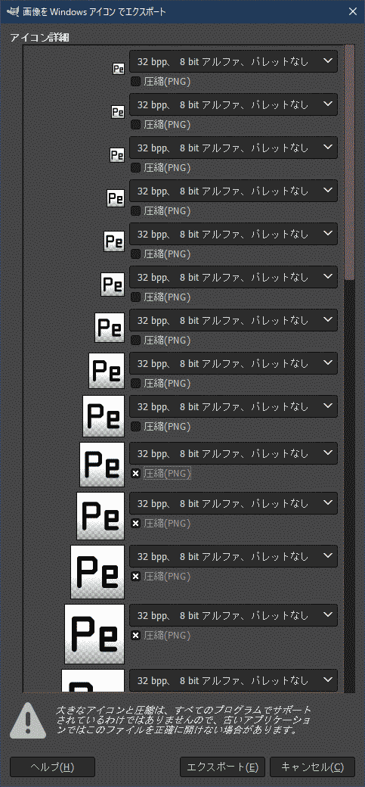

# アイコンリソース

## スクリプト

* `icon.ps1`
  1. SVGからPNGを生成
  2. PNGからICOを生成
* `icon.bat`
  * `icon.ps1` の呼び出し

スクリプト実行後に `Icon` ディレクトリに変換アイコンが出力される(出力ファイルはgit管理対象)。

## ICOの再圧縮

gimp に突っ込んで小さいやつ上位9個はそのままでそれ以降を圧縮チェックする。

自動化したかったけどまぁいいでしょ。

